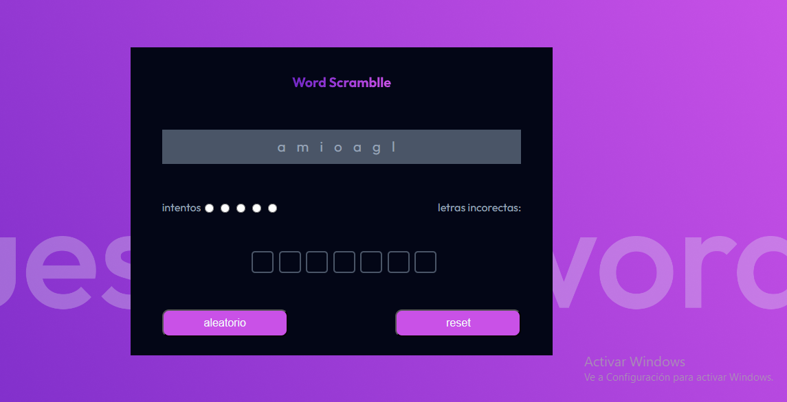

# Guess Word (Ahorcado)

es un juego para divinar la palabra revuelelta  puedes equivocarte hasta 5 veces te muestran las letras equivocadas que ya usaste para no utilizarlas nuevamente, 
el boton reset te reinicia los intentos y el boton aleatorio te cambia a otra palabra.

## Tecnologías Utilizadas
- HTML5
- CSS3
- JavaScript

## Funcionalidades
- [x] Página responsiva
- [x] peticion fetch para obtener la palabra aleatoriamente
- [x] Interacción mediante JavaScript
- [X] Se crean las casillas dinamicamente dependiendo la palabra mostrada 

## Captura de Pantalla

## link 
[Gues-Word](https://guess-word-github-io.vercel.app/ "Title")
